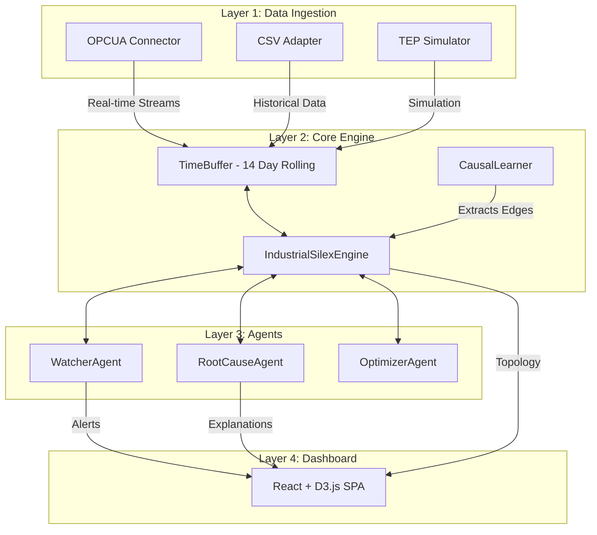

# 🏭 Clasp: Industrial Process Intelligence


**Clasp** builds a living, autonomous causal graph of industrial plants. Instead of traditional static dashboards that only show *what* happened, Clasp answers **WHY** it happened. 

By autonomously learning the lagged causality between hundreds of industrial sensors and valves, Clasp traces complex fault chains backward to pinpoint root causes, and projects anomalies forward to warn operators about emerging problems *before* they crash the plant.

---

## ✨ Key Features

- 🧠 **Living Causal Network**: Autonomously learns and updates a directed graph (NetworkX) of the physical plant purely from raw telemetry—identifying causality and operational delays (lag).
- 🔌 **Native OPC-UA Ingestion**: Seamlessly connects to standard industrial PLCs and SCADA systems via push-subscriptions, supporting resilient auto-reconnects and automatic variable discovery.
- 🕵️ **LLM-Powered Root Cause Analysis (RCA)**: A specialized `RootCauseAgent` dynamically walks the causal graph when a fault is detected, utilizing local or cloud LLMs (via the Kronos plugin system) to provide operators with human-readable forensic explanations.
- 🛡️ **Predictive Optimizer**: The `OptimizerAgent` projects anomalies forward in time to suggest safe, bounding-box-verified corrective actions.
- 📊 **Interactive Dashboard**: A polished React + D3.js Single Page Application (SPA) providing real-time telemetry charts, an interactive 2D topology view, background agent reasoning logs, and configuration management.
- 🔒 **Air-Gapped Ready**: Engineered specifically for high-security manufacturing environments. The system supports full on-premise deployments using local language models (Ollama/LM Studio).

---

## 🏗️ System Architecture

Clasp is built on top of the Silex cognitive engine and Kronos agent orchestration layer.



---

## 🚀 Quickstart

### 1. Install Dependencies
Ensure you have Python 3.11+ and Node.js installed.
```bash
git clone https://github.com/openyfai/Clasp.git
cd Clasp
pip install -e ".[dev]"
```

### 2. Export Vendor Engines & Setup
```bash
# Exports the required read-only Silex/Agent vendor files
python scripts/export_engines.py

# Run the Phase 0 smoke tests to ensure isolated environments (~/.clasp)
pytest tests/test_phase0_imports.py -v
```

### 3. Start the Backend API & OPC-UA Demo
To launch the FastAPI server, the OPC-UA mock simulation, and the Clasp engine simultaneously:
```bash
python scripts/run_opcua_demo.py
```
*(The backend runs on `http://localhost:8000`)*

### 4. Launch the Dashboard
In a separate terminal, start the React frontend:
```bash
cd dashboard
npm install
npm run dev
```
Navigate to **`http://localhost:5173`** to view the live interface.

---

## 📂 Project Structure

```text
Clasp/
├── clasp/
│   ├── vendor/           # Vendored Silex + Agent frameworks (Read-Only)
│   ├── industrial/       # Core Clasp Logic
│   │   ├── engine.py     # IndustrialSilexEngine main class
│   │   ├── causal_learner.py
│   │   ├── time_buffer.py 
│   │   ├── ingest/       # OPC-UA, TEP Simulator, CSV Adapters
│   │   ├── agents/       # Watcher, RootCause, Optimizer agents
│   │   └── api/          # FastAPI backend routes & WebSockets
│   └── config.py         # Global path definitions & parameters
├── dashboard/            # React + D3.js Dashboard Application
├── scripts/              # Setup and execution scripts
├── tests/                # Full PyTest verification suites
└── README.md
```

---

## ⚖️ Licensing

The Clasp core engine is source-available under the **Business Source License 1.1 (BSL 1.1)**, transitioning to the **Apache License 2.0** on July 1, 2030.

It is completely free to run in non-production, local development, testing, and academic environments. However, any use of the Software in a production plant environment or to provide a commercial service to third parties requires a separate commercial subscription from openyfai (YF). 

See the [`LICENSE`](LICENSE) file at the root of the project for full terms and conditions.
